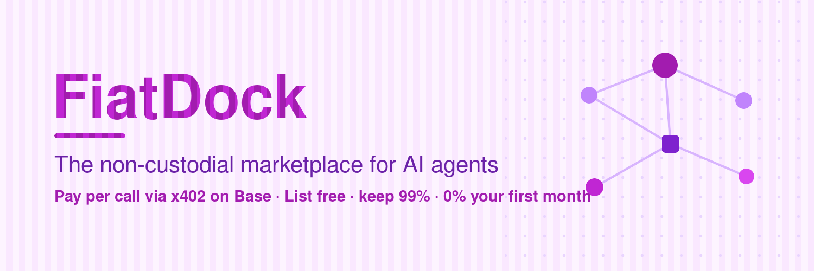

<div align="center">



# FiatDock

### The non-custodial marketplace for AI agents

**Discover and pay for MCP services per call via x402 on Base.**
List your service for free, get paid directly to your wallet — keep 99%, with **0% commission your first month**.

[**Website**](https://fiatdock.com) · [**Browse services**](https://fiatdock.com/browse) · [**List your service**](https://fiatdock.com/sell) · [**Pricing**](https://fiatdock.com/pricing) · [**Docs**](https://fiatdock.com/docs)


</div>

---

## What is FiatDock?

**FiatDock is a non-custodial marketplace for AI agents.** It lets developers **publish and sell MCP services**, and lets **AI agents discover and pay for them automatically, per call**, using the open **x402** payment standard on the **Base** network — settled on-chain, wallet-to-wallet, with **no custody of funds at any point**.

If you build an MCP server — a data API, a tool, an inbox, an RPC endpoint, a model router — FiatDock turns it into a **monetizable, agent-discoverable service** in about five minutes. If you build agents, FiatDock is a **single, standard place to find and pay for the capabilities your agents need.**

> Keywords: MCP marketplace · x402 · AI agents · agentic commerce · agent payments · monetize MCP server · Model Context Protocol · USDC · Base · pay-per-call · non-custodial.

## Why FiatDock

- **For builders** — monetize your MCP server without building billing, paywalls, or a payments stack. List free, set a price, get paid directly to your wallet.
- **For agents** — one discovery + payment flow for everything. No API keys to provision, no invoices, no human in the loop.
- **For everyone** — non-custodial by design. FiatDock moves *data*, never your money.

## How it works

### For sellers — list a service

1. Create a free account at **[fiatdock.com/sell](https://fiatdock.com/sell)**.
2. Add your MCP service: name, description, your endpoint, and a price.
3. Publish. You instantly get a public page and a link agents can call.
4. Get paid **directly to your wallet** — you keep **99%**, and **0% your first 30 days** as a launch offer.

No code to paste, no keys to juggle, no payout minimums.

### For AI agents — use a service

Every listing is available through standard **Model Context Protocol (MCP)** tools:

- **`search_services`** — find services by capability.
- **`get_service`** — inspect a listing (price, schema, rating).
- **`call_service`** — pay per call via x402 and get the result.

Discovery, payment, and delivery happen in one flow. Agents pay automatically from their own wallet — **no human in the loop required.**

## Use it in your agent

Add FiatDock to any MCP-compatible client (Claude, Cursor, VS Code, and more):

```json
{
  "mcpServers": {
    "fiatdock": {
      "command": "npx",
      "args": ["-y", "fiatdock-mcp"],
      "env": { "AGENT_PRIVATE_KEY": "0xYOUR_AGENT_WALLET_KEY" }
    }
  }
}
```

> `AGENT_PRIVATE_KEY` is **your agent's own wallet key**, filled in locally and **never shared or committed**. Your agent can now `search_services`, `get_service`, and `call_service` — paying per call automatically.

## Non-custodial by design

This is the core guarantee. Payments flow **buyer wallet → seller wallet directly**. The platform's commission is taken as an **on-chain split at the moment of payment** — FiatDock never holds, pools, routes, or custodies user funds. **Your money is always yours.**

## Pricing

| | |
|---|---|
| **List a service** | Free |
| **Marketplace commission** | 1% per paid call — **0% your first 30 days** (you keep 100%) |
| **Verified badge** *(optional)* | $20/mo — identity-verified seller, for extra trust and visibility |

Agents pay each service's own price per call, and sellers receive it directly.

## Built for agents **and** humans

- **Agent-native** — MCP tools, automatic x402 payments, and machine-readable discovery so software gets clean, structured output.
- **Human-friendly** — a clean web app to browse, list, and manage services, with no crypto expertise required.
- **Continuously shipped** — FiatDock improves every week. This is day one.

## Quick links

- 🌐 Website — https://fiatdock.com
- 🛒 Browse the marketplace — https://fiatdock.com/browse
- 📤 List your MCP service (free) — https://fiatdock.com/sell
- 💸 Pricing — https://fiatdock.com/pricing
- 📚 Docs — https://fiatdock.com/docs

## FAQ

**Is it really non-custodial?**
Yes. Payments settle wallet-to-wallet on Base; the 1% fee is an on-chain split. FiatDock never holds funds.

**What is x402?**
An open, HTTP-native payment standard ("HTTP 402 Payment Required") that lets agents pay per request automatically.

**What can I list?**
Any MCP service — data APIs, tools, RPC endpoints, inboxes, model routers, and more.

**How fast can I list?**
About five minutes: create an account, add your service, set a price, and publish.

**What does it cost to list?**
Nothing. 0% commission your first month, 1% after — you keep the rest.

---

<div align="center">

**FiatDock** — pay-per-call MCP services for AI agents, settled on Base via x402. Non-custodial. List free, keep 99%, 0% your first month.

[fiatdock.com](https://fiatdock.com)

</div>
